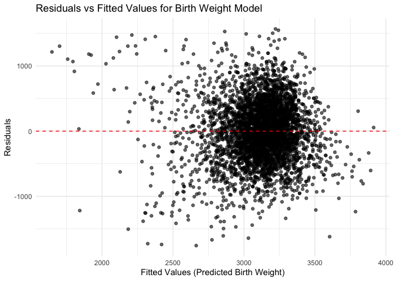
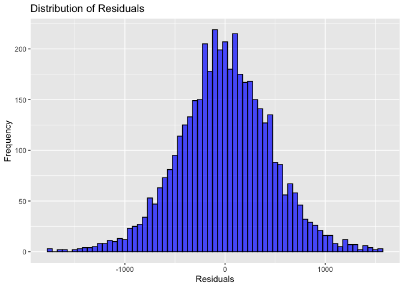
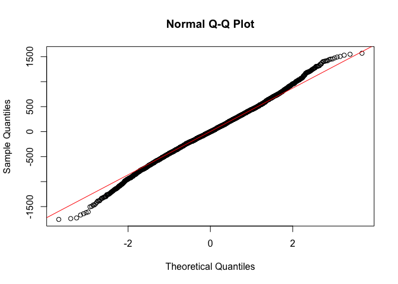
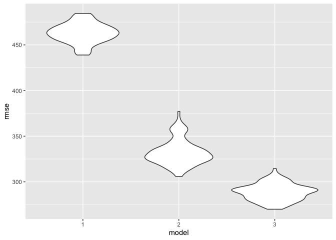
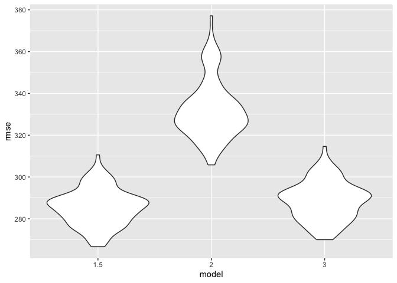

p8105_hw6_az2852
================

``` r
library(tidyverse)
library(modelr)
library(mgcv)
library(stringr)
library(broom)
```

``` r
set.seed(1)
```

# Problem 2

Load and prepare the homicide data.

``` r
homicide = read_csv("data/homicide-data.csv")
```

    ## Rows: 52179 Columns: 12
    ## ── Column specification ────────────────────────────────────────────────────────
    ## Delimiter: ","
    ## chr (9): uid, victim_last, victim_first, victim_race, victim_age, victim_sex...
    ## dbl (3): reported_date, lat, lon
    ## 
    ## ℹ Use `spec()` to retrieve the full column specification for this data.
    ## ℹ Specify the column types or set `show_col_types = FALSE` to quiet this message.

``` r
# Data preparation
homicide_df = homicide %>%
  mutate(city_state = str_c(city, state, sep = ", ")) %>%
  mutate(solved = ifelse(disposition == "Closed by arrest", 1, 0)) %>%
  filter(
    !(city_state %in% c("Dallas, TX", "Phoenix, AZ", "Kansas City, MO", "Tulsa, AL"))
  ) %>%
  filter(victim_race %in% c("White", "Black")) %>%
  mutate(victim_age = as.numeric(victim_age))
```

    ## Warning: There was 1 warning in `mutate()`.
    ## ℹ In argument: `victim_age = as.numeric(victim_age)`.
    ## Caused by warning:
    ## ! NAs introduced by coercion

Fit a logistic regression for Baltimore.

``` r
baltimore_data = homicide_df %>%
  filter(city_state == "Baltimore, MD")

baltimore_model = glm(
  solved ~ victim_age + victim_sex + victim_race,
  data = baltimore_data,
  family = binomial(link = "logit")
)

baltimore_results = broom::tidy(baltimore_model)

# Calculate adjusted odds ratio (OR) and confidence intervals for male vs female victims
baltimore_or = baltimore_results %>%
  filter(term == "victim_sexMale") %>%
  mutate(
    odds_ratio = exp(estimate), # Adjusted OR
    conf_low = exp(estimate - 1.96 * std.error), # Lower CI
    conf_high = exp(estimate + 1.96 * std.error) # Upper CI
  ) %>%
  select(term, odds_ratio, conf_low, conf_high)
```

Regression model for each city

``` r
city_results = homicide_df %>%
  group_by(city_state) %>%
  nest() %>%
  mutate(
    model = map(data, \(x) glm(solved ~ victim_age + victim_sex + victim_race, 
                            data = x, 
                            family = binomial(link = "logit"))), 
    tidy_model = map(model, broom::tidy) 
  ) %>%
  unnest(tidy_model) %>% 
  filter(term == "victim_sexMale") %>% 
  mutate(
    odds_ratio = exp(estimate), 
    conf_low = exp(estimate - 1.96 * std.error), 
    conf_high = exp(estimate + 1.96 * std.error) 
  ) %>%
  select(city_state, odds_ratio, conf_low, conf_high)
```

# Problem 3

load and clean the data

``` r
birthweight = read_csv("data/birthweight.csv")
```

    ## Rows: 4342 Columns: 20
    ## ── Column specification ────────────────────────────────────────────────────────
    ## Delimiter: ","
    ## dbl (20): babysex, bhead, blength, bwt, delwt, fincome, frace, gaweeks, malf...
    ## 
    ## ℹ Use `spec()` to retrieve the full column specification for this data.
    ## ℹ Specify the column types or set `show_col_types = FALSE` to quiet this message.

``` r
birthweight_df = birthweight %>%
  mutate(
    babysex = factor(babysex, levels = c(1, 2), labels = c("Male", "Female")),
    malform = factor(malform, levels = c(0, 1), labels = c("Absent", "Present")),
    mrace = factor(mrace, levels = c(1, 2, 3, 4, 8), 
                   labels = c("White", "Black", "Asian", "Puerto Rican", "Other")),
    frace = factor(frace, levels = c(1, 2, 3, 4, 8, 9), 
                   labels = c("White", "Black", "Asian", "Puerto Rican", "Other", "Unknown"))
  )
```

check for missing values

``` r
summary(birthweight_df)
```

    ##    babysex         bhead          blength           bwt           delwt      
    ##  Male  :2230   Min.   :21.00   Min.   :20.00   Min.   : 595   Min.   : 86.0  
    ##  Female:2112   1st Qu.:33.00   1st Qu.:48.00   1st Qu.:2807   1st Qu.:131.0  
    ##                Median :34.00   Median :50.00   Median :3132   Median :143.0  
    ##                Mean   :33.65   Mean   :49.75   Mean   :3114   Mean   :145.6  
    ##                3rd Qu.:35.00   3rd Qu.:51.00   3rd Qu.:3459   3rd Qu.:157.0  
    ##                Max.   :41.00   Max.   :63.00   Max.   :4791   Max.   :334.0  
    ##     fincome               frace         gaweeks         malform    
    ##  Min.   : 0.00   White       :2123   Min.   :17.70   Absent :4327  
    ##  1st Qu.:25.00   Black       :1911   1st Qu.:38.30   Present:  15  
    ##  Median :35.00   Asian       :  46   Median :39.90                 
    ##  Mean   :44.11   Puerto Rican: 248   Mean   :39.43                 
    ##  3rd Qu.:65.00   Other       :  14   3rd Qu.:41.10                 
    ##  Max.   :96.00   Unknown     :   0   Max.   :51.30                 
    ##     menarche        mheight          momage              mrace     
    ##  Min.   : 0.00   Min.   :48.00   Min.   :12.0   White       :2147  
    ##  1st Qu.:12.00   1st Qu.:62.00   1st Qu.:18.0   Black       :1909  
    ##  Median :12.00   Median :63.00   Median :20.0   Asian       :  43  
    ##  Mean   :12.51   Mean   :63.49   Mean   :20.3   Puerto Rican: 243  
    ##  3rd Qu.:13.00   3rd Qu.:65.00   3rd Qu.:22.0   Other       :   0  
    ##  Max.   :19.00   Max.   :77.00   Max.   :44.0                      
    ##      parity            pnumlbw     pnumsga      ppbmi            ppwt      
    ##  Min.   :0.000000   Min.   :0   Min.   :0   Min.   :13.07   Min.   : 70.0  
    ##  1st Qu.:0.000000   1st Qu.:0   1st Qu.:0   1st Qu.:19.53   1st Qu.:110.0  
    ##  Median :0.000000   Median :0   Median :0   Median :21.03   Median :120.0  
    ##  Mean   :0.002303   Mean   :0   Mean   :0   Mean   :21.57   Mean   :123.5  
    ##  3rd Qu.:0.000000   3rd Qu.:0   3rd Qu.:0   3rd Qu.:22.91   3rd Qu.:134.0  
    ##  Max.   :6.000000   Max.   :0   Max.   :0   Max.   :46.10   Max.   :287.0  
    ##      smoken           wtgain      
    ##  Min.   : 0.000   Min.   :-46.00  
    ##  1st Qu.: 0.000   1st Qu.: 15.00  
    ##  Median : 0.000   Median : 22.00  
    ##  Mean   : 4.145   Mean   : 22.08  
    ##  3rd Qu.: 5.000   3rd Qu.: 28.00  
    ##  Max.   :60.000   Max.   : 89.00

Fit regression models of birth weight. We propose a model using
gestational weeks, mother’s age and smoking.

``` r
# Predict birth weight using gestational age, mother's age, and smoking
model_1 = lm(bwt ~ gaweeks + momage + smoken, data = birthweight_df)

summary(model_1)
```

    ## 
    ## Call:
    ## lm(formula = bwt ~ gaweeks + momage + smoken, data = birthweight_df)
    ## 
    ## Residuals:
    ##      Min       1Q   Median       3Q      Max 
    ## -1756.61  -289.21    -3.48   295.96  1568.77 
    ## 
    ## Coefficients:
    ##             Estimate Std. Error t value Pr(>|t|)    
    ## (Intercept) 291.9462    91.9193   3.176   0.0015 ** 
    ## gaweeks      65.6990     2.2376  29.362  < 2e-16 ***
    ## momage       12.8165     1.8242   7.026 2.46e-12 ***
    ## smoken       -6.7483     0.9494  -7.108 1.37e-12 ***
    ## ---
    ## Signif. codes:  0 '***' 0.001 '**' 0.01 '*' 0.05 '.' 0.1 ' ' 1
    ## 
    ## Residual standard error: 461.9 on 4338 degrees of freedom
    ## Multiple R-squared:  0.1874, Adjusted R-squared:  0.1868 
    ## F-statistic: 333.4 on 3 and 4338 DF,  p-value: < 2.2e-16

``` r
# Add predictions and residuals
data_with_preds = birthweight_df %>%
  add_predictions(model_1, var = "fitted_bwt") %>%
  add_residuals(model_1, var = "residuals_bwt")

# Plot residuals against fitted values
ggplot(data_with_preds, aes(x = fitted_bwt, y = residuals_bwt)) +
  geom_point(alpha = 0.6) +
  geom_hline(yintercept = 0, color = "red", linetype = "dashed") +
  labs(
    title = "Residuals vs Fitted Values for Birth Weight Model",
    x = "Fitted Values (Predicted Birth Weight)",
    y = "Residuals"
  ) +
  theme_minimal()
```

<!-- -->

``` r
# Check residual normality with a histogram & Q-Q plot
ggplot(data_with_preds, aes(x = residuals_bwt)) +
  geom_histogram(binwidth = 50, fill = "blue", color = "black", alpha = 0.7) +
  labs(
    title = "Distribution of Residuals",
    x = "Residuals",
    y = "Frequency"
  )
```

<!-- -->

``` r
qqnorm(data_with_preds$residuals_bwt)
qqline(data_with_preds$residuals_bwt, col = "red")
```

<!-- --> The
residual plot show a slight heteroscedasticity as lower birth weights
have larger residuals than higher birth weights.

The residual histogram appears to be bell-shaped.

The QQ plot show that points fall on the diagonal line, except a slight
deviation at the tails, but this may not be a concern considering the
size of our data (4342 observations).

## compare the proposed model with 2 alternative models

``` r
# 2. Alternative model 1: length at birth and gestational age (main effects only)
model_2 = lm(bwt ~ blength + gaweeks, data = birthweight_df)

summary(model_2)
```

    ## 
    ## Call:
    ## lm(formula = bwt ~ blength + gaweeks, data = birthweight_df)
    ## 
    ## Residuals:
    ##     Min      1Q  Median      3Q     Max 
    ## -1709.6  -215.4   -11.4   208.2  4188.8 
    ## 
    ## Coefficients:
    ##              Estimate Std. Error t value Pr(>|t|)    
    ## (Intercept) -4347.667     97.958  -44.38   <2e-16 ***
    ## blength       128.556      1.990   64.60   <2e-16 ***
    ## gaweeks        27.047      1.718   15.74   <2e-16 ***
    ## ---
    ## Signif. codes:  0 '***' 0.001 '**' 0.01 '*' 0.05 '.' 0.1 ' ' 1
    ## 
    ## Residual standard error: 333.2 on 4339 degrees of freedom
    ## Multiple R-squared:  0.5769, Adjusted R-squared:  0.5767 
    ## F-statistic:  2958 on 2 and 4339 DF,  p-value: < 2.2e-16

``` r
# 3. Alternative model 2: head circumference, length, sex, and all interactions
model_3 = lm(bwt ~ bhead * blength * babysex, data = birthweight_df)

summary(model_3)
```

    ## 
    ## Call:
    ## lm(formula = bwt ~ bhead * blength * babysex, data = birthweight_df)
    ## 
    ## Residuals:
    ##      Min       1Q   Median       3Q      Max 
    ## -1132.99  -190.42   -10.33   178.63  2617.96 
    ## 
    ## Coefficients:
    ##                               Estimate Std. Error t value Pr(>|t|)    
    ## (Intercept)                 -7176.8170  1264.8397  -5.674 1.49e-08 ***
    ## bhead                         181.7956    38.0542   4.777 1.84e-06 ***
    ## blength                       102.1269    26.2118   3.896 9.92e-05 ***
    ## babysexFemale                6374.8684  1677.7669   3.800 0.000147 ***
    ## bhead:blength                  -0.5536     0.7802  -0.710 0.478012    
    ## bhead:babysexFemale          -198.3932    51.0917  -3.883 0.000105 ***
    ## blength:babysexFemale        -123.7729    35.1185  -3.524 0.000429 ***
    ## bhead:blength:babysexFemale     3.8781     1.0566   3.670 0.000245 ***
    ## ---
    ## Signif. codes:  0 '***' 0.001 '**' 0.01 '*' 0.05 '.' 0.1 ' ' 1
    ## 
    ## Residual standard error: 287.7 on 4334 degrees of freedom
    ## Multiple R-squared:  0.6849, Adjusted R-squared:  0.6844 
    ## F-statistic:  1346 on 7 and 4334 DF,  p-value: < 2.2e-16

Now, do cross-validation between 3 models

``` r
# create training and testing samples
cv_df = 
  crossv_mc(birthweight_df, 100) %>%
  mutate(
    train = map(train, as_tibble),
    test = map(test, as_tibble))

cv_df %>% pull(train) %>% nth(1) %>% as.tibble()
```

    ## Warning: `as.tibble()` was deprecated in tibble 2.0.0.
    ## ℹ Please use `as_tibble()` instead.
    ## ℹ The signature and semantics have changed, see `?as_tibble`.
    ## This warning is displayed once every 8 hours.
    ## Call `lifecycle::last_lifecycle_warnings()` to see where this warning was
    ## generated.

    ## # A tibble: 3,473 × 20
    ##    babysex bhead blength   bwt delwt fincome frace gaweeks malform menarche
    ##    <fct>   <dbl>   <dbl> <dbl> <dbl>   <dbl> <fct>   <dbl> <fct>      <dbl>
    ##  1 Female     34      51  3629   177      35 White    39.9 Absent        13
    ##  2 Male       34      48  3062   156      65 Black    25.9 Absent        14
    ##  3 Female     36      50  3345   148      85 White    39.9 Absent        12
    ##  4 Male       34      52  3062   157      55 White    40   Absent        14
    ##  5 Female     34      52  3374   156       5 White    41.6 Absent        13
    ##  6 Female     33      46  2523   126      96 Black    40.3 Absent        14
    ##  7 Male       36      52  3515   146      85 White    40.3 Absent        11
    ##  8 Male       33      50  3459   169      75 Black    40.7 Absent        12
    ##  9 Female     35      51  3317   130      55 White    43.4 Absent        13
    ## 10 Male       35      51  3459   146      55 White    39.4 Absent        12
    ## # ℹ 3,463 more rows
    ## # ℹ 10 more variables: mheight <dbl>, momage <dbl>, mrace <fct>, parity <dbl>,
    ## #   pnumlbw <dbl>, pnumsga <dbl>, ppbmi <dbl>, ppwt <dbl>, smoken <dbl>,
    ## #   wtgain <dbl>

``` r
cv_res = 
  cv_df |> #fit the regression models on training data
  mutate(
    model_1  = map(train, \(df) lm(bwt ~ gaweeks + momage + smoken, data = df)),
    model_2  = map(train, \(df) lm(bwt ~ blength + gaweeks, data = df)),
    model_3  = map(train, \(df) lm(bwt ~ bhead * blength * babysex, data = df))) |> #calculate the RMSE for the model fit on test data
  mutate(
    rmse_1 = map2_dbl(model_1, test, \(mod, df) rmse(model = mod, data = df)),
    rmse_2 = map2_dbl(model_2, test, \(mod, df) rmse(model = mod, data = df)),
    rmse_3 = map2_dbl(model_3, test, \(mod, df) rmse(model = mod, data = df)))

cv_res
```

    ## # A tibble: 100 × 9
    ##    train    test     .id   model_1 model_2 model_3 rmse_1 rmse_2 rmse_3
    ##    <list>   <list>   <chr> <list>  <list>  <list>   <dbl>  <dbl>  <dbl>
    ##  1 <tibble> <tibble> 001   <lm>    <lm>    <lm>      463.   360.   302.
    ##  2 <tibble> <tibble> 002   <lm>    <lm>    <lm>      463.   322.   280.
    ##  3 <tibble> <tibble> 003   <lm>    <lm>    <lm>      454.   307.   279.
    ##  4 <tibble> <tibble> 004   <lm>    <lm>    <lm>      471.   337.   298.
    ##  5 <tibble> <tibble> 005   <lm>    <lm>    <lm>      484.   367.   303.
    ##  6 <tibble> <tibble> 006   <lm>    <lm>    <lm>      444.   314.   282.
    ##  7 <tibble> <tibble> 007   <lm>    <lm>    <lm>      446.   357.   290.
    ##  8 <tibble> <tibble> 008   <lm>    <lm>    <lm>      456.   346.   301.
    ##  9 <tibble> <tibble> 009   <lm>    <lm>    <lm>      464.   327.   287.
    ## 10 <tibble> <tibble> 010   <lm>    <lm>    <lm>      443.   338.   292.
    ## # ℹ 90 more rows

see the distribution of RMSE

``` r
cv_res |> 
  select(starts_with("rmse")) |> 
  pivot_longer(
    everything(),
    names_to = "model", 
    values_to = "rmse",
    names_prefix = "rmse_") |> 
  mutate(model = fct_inorder(model))|> 
  ggplot(aes(x = model, y = rmse)) + geom_violin()
```

<!-- -->

Model 2 and 3 clearly outperforms model 1. Let’s try revising model 1.

We found that momage and smoken doesn’t explain much of the variances.
So for simplicity, we remove them and keep gaweeks and bhead \* blength
\* babysex.

``` r
model_1.5  = lm(bwt ~ gaweeks + bhead * blength * babysex, data = birthweight_df)

summary(model_1.5)
```

    ## 
    ## Call:
    ## lm(formula = bwt ~ gaweeks + bhead * blength * babysex, data = birthweight_df)
    ## 
    ## Residuals:
    ##      Min       1Q   Median       3Q      Max 
    ## -1114.50  -189.72   -11.37   178.56  2590.49 
    ## 
    ## Coefficients:
    ##                               Estimate Std. Error t value Pr(>|t|)    
    ## (Intercept)                 -5840.0302  1259.2350  -4.638 3.63e-06 ***
    ## gaweeks                        14.7064     1.5234   9.654  < 2e-16 ***
    ## bhead                         129.0169    38.0506   3.391 0.000703 ***
    ## blength                        68.1864    26.1746   2.605 0.009217 ** 
    ## babysexFemale                5618.9332  1662.0478   3.381 0.000729 ***
    ## bhead:blength                   0.3715     0.7780   0.478 0.632969    
    ## bhead:babysexFemale          -175.4012    50.6129  -3.466 0.000534 ***
    ## blength:babysexFemale        -109.1637    34.7838  -3.138 0.001710 ** 
    ## bhead:blength:babysexFemale     3.4299     1.0466   3.277 0.001057 ** 
    ## ---
    ## Signif. codes:  0 '***' 0.001 '**' 0.01 '*' 0.05 '.' 0.1 ' ' 1
    ## 
    ## Residual standard error: 284.7 on 4333 degrees of freedom
    ## Multiple R-squared:  0.6915, Adjusted R-squared:  0.6909 
    ## F-statistic:  1214 on 8 and 4333 DF,  p-value: < 2.2e-16

``` r
cv_res2 = 
  cv_df |> #fit the regression models on training data
  mutate(
    model_1.5  = map(train, \(df) lm(bwt ~ gaweeks + bhead * blength * babysex, data = df)),
    model_2  = map(train, \(df) lm(bwt ~ blength + gaweeks, data = df)),
    model_3  = map(train, \(df) lm(bwt ~ bhead * blength * babysex, data = df))) |> #calculate the RMSE for the model fit on test data
  mutate(
    rmse_1.5 = map2_dbl(model_1.5, test, \(mod, df) rmse(model = mod, data = df)),
    rmse_2 = map2_dbl(model_2, test, \(mod, df) rmse(model = mod, data = df)),
    rmse_3 = map2_dbl(model_3, test, \(mod, df) rmse(model = mod, data = df)))

cv_res2
```

    ## # A tibble: 100 × 9
    ##    train    test     .id   model_1.5 model_2 model_3 rmse_1.5 rmse_2 rmse_3
    ##    <list>   <list>   <chr> <list>    <list>  <list>     <dbl>  <dbl>  <dbl>
    ##  1 <tibble> <tibble> 001   <lm>      <lm>    <lm>        298.   360.   302.
    ##  2 <tibble> <tibble> 002   <lm>      <lm>    <lm>        277.   322.   280.
    ##  3 <tibble> <tibble> 003   <lm>      <lm>    <lm>        276.   307.   279.
    ##  4 <tibble> <tibble> 004   <lm>      <lm>    <lm>        295.   337.   298.
    ##  5 <tibble> <tibble> 005   <lm>      <lm>    <lm>        300.   367.   303.
    ##  6 <tibble> <tibble> 006   <lm>      <lm>    <lm>        278.   314.   282.
    ##  7 <tibble> <tibble> 007   <lm>      <lm>    <lm>        285.   357.   290.
    ##  8 <tibble> <tibble> 008   <lm>      <lm>    <lm>        298.   346.   301.
    ##  9 <tibble> <tibble> 009   <lm>      <lm>    <lm>        284.   327.   287.
    ## 10 <tibble> <tibble> 010   <lm>      <lm>    <lm>        289.   338.   292.
    ## # ℹ 90 more rows

``` r
cv_res2 |> 
  select(starts_with("rmse")) |> 
  pivot_longer(
    everything(),
    names_to = "model", 
    values_to = "rmse",
    names_prefix = "rmse_") |> 
  mutate(model = fct_inorder(model))|> 
  ggplot(aes(x = model, y = rmse)) + geom_violin()
```

<!-- -->
Model 1.5 seems to be slightly better than model 3. Including gaweeks in
addition to the interactions between bhead \* blength \* babysex is a
reasonable choice.
